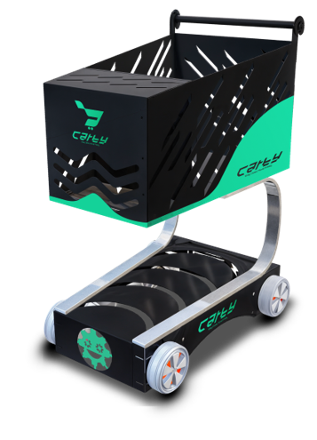
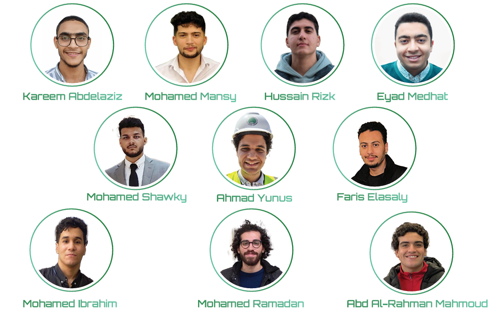

# 🛒 Carty — Smart Follow-Me Cart for Disabled & Elderly Assistance

<p align="center">
  
</p>

<p align="center">
  <b>Stay Close, Move Freely.</b>
</p>

**Graduation Project II — 2025**  
**Mechatronics Engineering Program — Faculty of Engineering, Mansoura University**

**Official Project Title:**  
*Automated “Follow-Me” Cart Using AI and Computer Vision for Disabled and Elderly Assistance*

Carty is an **AI-powered assistive smart cart** designed to improve independence, safety, and convenience for elderly people and individuals with physical disabilities. The system combines **computer vision, gesture recognition, obstacle detection, embedded control, custom electronics, mechanical design, and a mobile-app interface** in a single multidisciplinary prototype.

The cart can recognize its user, respond to hand gestures, follow autonomously, detect nearby obstacles, and also support manual control. A companion app concept extends the system with cart control, battery monitoring, store navigation, and cart-content tracking.

---

## 🎯 Project Goal

The goal was to create a **hands-free mobility and carrying assistant** that reduces the physical effort required for everyday tasks while remaining safe and intuitive to use.

Core objectives included:

- autonomous user following
- hand-gesture interaction
- real-time obstacle detection and avoidance
- manual control when needed
- robust and portable mechanical design
- real-time AI processing on embedded hardware
- modular electronics and custom PCB integration
- battery-powered operation
- user monitoring and control through a mobile interface

---

## ✨ Key Features

### 🤖 AI-Powered Gesture Recognition

The cart uses a camera and **MediaPipe** hand tracking to detect hand landmarks and interpret gestures.

Examples documented in the project include:

```text
Open / Follow gesture → Follow the user
Stop gesture          → Stop the cart
```

MediaPipe was selected because it is lightweight, optimized for real-time operation, and provides **21 hand landmarks** for gesture classification.

### 👕 User / Vest Recognition

A **YOLOv8** model was developed for visual recognition, including vest/clothing detection used to help identify and track the intended user.

The development process included:

```text
Dataset Collection
        ↓
Annotation
        ↓
YOLOv8 Fine-Tuning
        ↓
Data Augmentation
        ↓
Real-Time Testing
        ↓
Jetson Nano Deployment
```

### 👁️ Obstacle Detection & Avoidance

The cart combines:

- IR sensors
- ultrasonic sensors
- camera-based perception

to detect obstacles and improve safe navigation.

### 🎮 Manual Control

Manual control is supported through a **joystick / Arduino Nano control layer**, allowing the system to be operated directly when autonomous control is not appropriate.

### 📱 Mobile App / UI

The documented Carty mobile-app interface includes:

- user registration
- recognition screen
- store mapping
- manual cart control
- automatic/manual mode selection
- speed selection
- battery monitoring
- cart-content monitoring
- item count and cost display
- remote cart control

UI documentation is available in the `UI/` folder.

---

# 🧠 System Architecture

```text
                         ┌─────────────────────┐
                         │       Camera        │
                         └─────────┬───────────┘
                                   │
                                   ▼
                         ┌─────────────────────┐
                         │  NVIDIA Jetson Nano │
                         │ MediaPipe / YOLOv8  │
                         │ Computer Vision     │
                         └─────────┬───────────┘
                                   │ UART
                                   ▼
                         ┌─────────────────────┐
                         │    Arduino Nano     │
                         │    ATmega328P       │
                         └──────┬───────┬──────┘
                                │       │
                   ┌────────────┘       └─────────────┐
                   ▼                                  ▼
          ┌────────────────┐                ┌─────────────────┐
          │ IR / Ultrasonic│                │  Motor Drivers  │
          │    Sensors     │                └────────┬────────┘
          └────────────────┘                         │
                                                   ▼
                                           ┌──────────────┐
                                           │ Wiper Motors │
                                           │   + Wheels   │
                                           └──────────────┘
```

The embedded software also follows a layered structure:

```text
Application Layer
      ↓
HAL — Hardware Abstraction Layer
      ↓
MCAL — Microcontroller Abstraction Layer
```

The project documentation describes UART communication at **9600 baud** between embedded subsystems.

---

# ⚙️ Mechanical Design

The cart was developed through multiple SolidWorks iterations before the final design was selected.

<p align="center">
  
</p>

The design consists of:

- upper storage body
- lower drive chassis
- component enclosure
- curved structural linking members
- threaded support rods
- four wheels
- four wiper motors
- custom motor-wheel couplers
- integrated camera mounting area
- hardware and wiring passages

### Main Materials

| Section | Material / Purpose |
|---|---|
| Lower chassis | Galvanized sheet metal for load-bearing strength |
| Upper side panels | Sheet metal for structural stiffness |
| Electronics enclosure | Wood for lightweight electrical insulation |
| Linking members | Steel for stability and support |
| Couplers | Machined steel |
| Handle | Wood |

The project book documents an overall cart size of approximately **600 × 820 mm** and a prototype mass of approximately **20 kg**.

---

## 🚗 Drive System

The cart uses **four wiper motors**, selected for their high torque, availability, durability, and cost effectiveness.

Documented motor characteristics include:

```text
Rated torque       ≈ 20 Nm per motor
Operating voltage  = 12 V
Operating current  ≈ 4–5 A under load
Number of motors   = 4
```

The design study estimated a maximum supported operating mass of approximately:

```text
62.7 kg
```

for the selected drive configuration.

---

# 🔌 Hardware

Major hardware used in the prototype includes:

| Component | Function |
|---|---|
| NVIDIA Jetson Nano | AI and computer-vision processing |
| Arduino Nano | Motor/sensor control and embedded coordination |
| Camera | User tracking and gesture recognition |
| IR Sensors | Short-range obstacle detection |
| Ultrasonic Sensors | Distance measurement / obstacle detection |
| Wiper Motors | Cart movement |
| Motor Drivers | Direction and PWM speed control |
| Joystick | Manual control |
| Battery | Mobile power source |
| Custom PCBs | Motor control, safety, and control integration |

### Jetson Nano

The project uses the NVIDIA Jetson Nano as the main AI computing platform.

```text
GPU:      128-core Maxwell
Memory:   4 GB LPDDR4
I/O:      USB 3.0, CSI camera, GPIO
```

### Camera

```text
Resolution:      1920 × 1080
Frame rate:      30 FPS
Field of view:   120°
```

### Sensors

**IR Sensors**
- 5 V operation
- short-range obstacle detection
- front and side placement

**Ultrasonic Sensors**
```text
Detection range: 2 cm – 4 m
Operating voltage: 5 V
Accuracy: ±3 mm
```

---

# 🧩 Custom PCB Design

Three custom PCBs were designed as part of the hardware system.

### 1. Motor Driver PCB
Responsible for:
- motor direction control
- PWM-based speed control
- interfacing the Arduino Nano with the motors
- high-current drive operation
- thermal management

### 2. Safety PCB
Designed for:
- protection mechanisms
- power management
- automatic disconnection during faults
- improved electrical reliability

### 3. Nano & Joystick PCB
Integrates:
- Arduino Nano
- joystick input
- motor-control signals
- sensor connections
- Jetson Nano communication
- power distribution
- real-time coordination

PCB design and simulation work included **EasyEDA** and **Proteus**.

---

# 💻 Software & Computer Vision

The software side combines embedded programming with real-time computer vision.

### Main Technologies

```text
Python
OpenCV
MediaPipe
YOLOv8 / Ultralytics
PyTorch
NumPy
Pandas
NVIDIA Jetson Nano
Arduino / ATmega328P
UART
```

### Computer-Vision Pipeline

```text
Camera Feed
    ↓
User / Clothing Recognition
    ↓
Hand Landmark Detection
    ↓
Gesture Classification
    ↓
Movement Command
    ↓
Jetson Nano
    ↓
UART
    ↓
Arduino Nano
    ↓
Motor Control
```

---

# 📱 Carty App UI

The `UI/` folder contains **8 UI images** and the full `ui.pdf`.

The interface concept covers:

### Registration & Recognition
- user registration
- front-camera recognition

### Cart Control
- forward / reverse / left / right
- low / medium / high speed
- manual mode
- automatic mode

### Store Mapping
- navigation interface
- destination / product search concept

### Battery Monitoring
- battery percentage
- remaining operating time

### Cart Content
- number of items
- used cart space
- total cost

The broader project documentation also describes synchronization and remote control through the mobile application.

---

# 🧪 Testing & Validation

The `Testing/` folder documents the project from subsystem testing to complete real-world operation.

### 1. `Assembly Final Project.mp4`
Shows the final mechanical assembly and integration of the cart.

### 2. `Computer Vision Test 1.mp4`
Tests the **Jetson Nano computer-vision / hand-gesture recognition pipeline**.

### 3. `Computer Vision Test 2.mp4`
Further tests gesture recognition and AI behavior under practical conditions.

### 4. `Practical Test.mp4`
Demonstrates the **complete smart cart working as an integrated system**, including recognition and physical cart movement.

Testing documented during the project also included:
- motor load testing
- PWM tuning
- sensor reliability testing
- different lighting environments
- battery/power testing
- hardware/software integration
- computer-vision validation

---

# 📚 Project Documentation

### `Carty.pdf` / `Carty.pptx`
The main project presentation covers:
- project overview and goals
- mechanical design
- hardware
- PCB design
- computer vision
- MediaPipe gesture recognition
- YOLOv8 recognition
- Jetson Nano environment
- embedded architecture
- mobile UI
- system testing

### `Graduation_Project_2_Book/`
Contains the complete Graduation Project II documentation, including:
- literature review
- mechanical design
- fabrication
- hardware implementation
- PCB design
- software integration
- AI and computer vision
- Jetson Nano setup
- ATmega328P architecture
- UI design
- testing
- project management
- cost analysis
- challenges
- future work

### `Add-Ons/`
Contains the final communication and exhibition material:
- banners
- poster
- brochure

---

# 👥 Team

<p align="center">
  
</p>

**Project Team**

- Hussain Ahmed Ibrahim Abd Al-Aziz Rizk
- Eyad Medhat Mohamed Abdeljawad
- Mohamed Ahmed Fouad Ahmed Mansy
- Kareem Abdelaziz Ibrahim Abdallah
- Ahmad Mohammad Abdulmajid Yunus
- Mohamed Shawky Shawky Soliman
- Faris El-Sayed Nabeeh Elasaly
- Mohamed Ahmed Ramadan Abd Al-Atty
- Mohamed Ibrahim Abd El-Mawla
- Abd Al-Rahman Mahmoud El-Saeed Mohamed

**Supervisors**
- Prof. Sabry Saraya
- Eng. Ali El-Henidy

---

# 🎓 Project Information

**Project:** Carty — Automated Follow-Me Cart Using AI and Computer Vision for Disabled and Elderly Assistance  
**Type:** Graduation Project II  
**Year:** 2025  
**Academic Year:** 2024–2025  
**Program:** Mechatronics Engineering  
**Faculty:** Faculty of Engineering  
**University:** Mansoura University  

---

## 🚀 What This Project Demonstrates

- Mechanical CAD and fabrication
- Autonomous mobile robotics
- AI and computer vision
- Embedded systems
- Sensor integration
- Motor control
- Custom PCB design
- UART communication
- Edge AI deployment
- Human-machine interaction
- Mobile UI/UX design
- Practical integration and testing

> **Carty** demonstrates how mechanical engineering, embedded electronics, artificial intelligence, and computer vision can be integrated into an assistive robotic system designed around a real human need.
